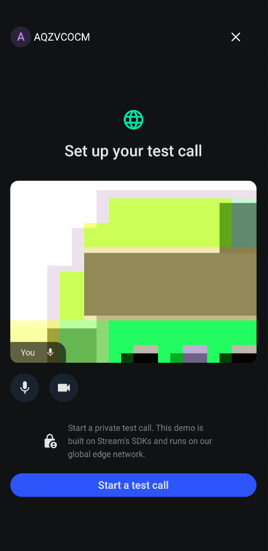

<h1 align="center">Android Video Chat</h1>


<p align="center">
  <a href="https://opensource.org/licenses/Apache-2.0"></a>
  <a href="https://android-arsenal.com/api?level=21"></a>
  <a href="https://github.com/GetStream/android-video-chat/actions/workflows/android.yml"></a>
  <a href="https://getstream.io?utm_source=Github&utm_medium=Jaewoong_OSS&utm_content=Developer&utm_campaign=Github_April2024_Jaewoong_Android_Video_Chat&utm_term=DevRelOss"></a>
</p>

⚡️ Android Video Chat demonstrates to utilize the [Stream Video SDK](https://getstream.io/video/sdk/android/?utm_source=Github&utm_medium=Jaewoong_OSS&utm_content=Developer&utm_campaign=Github_April2024_Jaewoong_Android_Video_Samples&utm_term=DevRelOss) and [Stream Chat SDK](https://getstream.io/chat/compose/tutorial/?utm_source=Github&utm_medium=Jaewoong_OSS&utm_content=Developer&utm_campaign=Github_April2024_Jaewoong_Android_Video_Chat&utm_term=DevRelOss) to implement a real-time video chat application, such as Zoom and Google Meet.

## 📲 Download APK
Go to the [Releases](https://github.com/GetStream/android-video-chat/releases) to download the latest APK. The application is also available on [Google Play](https://play.google.com/store/apps/details?id=io.getstream.video.android).

## 📷 Previews

<p align="center">


</br>


</p>

<a href="https://getstream.io/video/sdk/android/?utm_source=Github&utm_medium=Jaewoong_OSS&utm_content=Developer&utm_campaign=Github_April2024_Jaewoong_Android_Video_Samples&utm_term=DevRelOss">

</a>

## 🔗 Quick Links

Stream offers seamless Video/Chat SDK solutions that allow you to implement video calling, audio/video room, live streaming, and real-time chat using Jetpack Compose. If you're interested in learning the Stream Video & Chat SDKs, check out the GitHub repositories below:

- [Register For a Free Account](https://getstream.io/try-for-free/?utm_source=Github&utm_medium=Jaewoong_OSS&utm_content=Developer&utm_campaign=Github_April2024_Jaewoong_Android_Video_Chat&utm_term=DevRelOss)
- [Android Video SDK Repository](https://github.com/GetStream/stream-video-android)
- [Android Chat SDK Repository](https://github.com/GetStream/stream-chat-android)

## 📕 Video Tutorials

You can learn how to implement video features following the video tutorials: [Video Calling Tutorial](https://getstream.io/video/sdk/android/tutorial/video-calling/?utm_source=Github&utm_medium=Jaewoong_OSS&utm_content=Developer&utm_campaign=Github_April2024_Jaewoong_Android_Video_Chat&utm_term=DevRelOss), [Audio Room Tutorial](https://getstream.io/video/sdk/android/tutorial/audio-room/?utm_source=Github&utm_medium=Jaewoong_OSS&utm_content=Developer&utm_campaign=Github_April2024_Jaewoong_Android_Video_Chat&utm_term=DevRelOss), and  [Livestreaming Tutorial](https://getstream.io/video/sdk/android/tutorial/livestreaming/?utm_source=Github&utm_medium=Jaewoong_OSS&utm_content=Developer&utm_campaign=Github_April2024_Jaewoong_Android_Video_Chat&utm_term=DevRelOss).

If you want to learn the details, you can also refer to the docs below:

- [Compose UI Components Documentation](https://getstream.io/video/docs/android/ui-components/overview/?utm_source=Github&utm_medium=Jaewoong_OSS&utm_content=Developer&utm_campaign=Github_April2024_Jaewoong_Android_Video_Chat&utm_term=DevRelOss)
- [UI Cookbook](https://getstream.io/video/docs/android/ui-cookbook/overview/?utm_source=Github&utm_medium=Jaewoong_OSS&utm_content=Developer&utm_campaign=Github_April2024_Jaewoong_Android_Video_Chat&utm_term=DevRelOss)
- [Joining & Creating Calls](https://getstream.io/video/docs/android/guides/joining-creating-calls/?utm_source=Github&utm_medium=Jaewoong_OSS&utm_content=Developer&utm_campaign=Github_April2024_Jaewoong_Android_Video_Chat&utm_term=DevRelOss)

## 📗 Chat Tutorials

You can learn how to implement chat features following the chat tutorials:  [Android Chat Tutorial](https://getstream.io/tutorials/android-chat/?utm_source=Github&utm_medium=Jaewoong_OSS&utm_content=Developer&utm_campaign=Github_April2024_Jaewoong_Android_Video_Chat&utm_term=DevRelOss), and [Compose Chat Tutorial](https://getstream.io/chat/compose/tutorial/?utm_source=Github&utm_medium=Jaewoong_OSS&utm_content=Developer&utm_campaign=Github_April2024_Jaewoong_Android_Video_Chat&utm_term=DevRelOss).

If you want to learn the details, you can also refer to the docs below:

- [Client Documentation](https://getstream.io/chat/docs/android/?language=kotlin/?utm_source=Github&utm_medium=Jaewoong_OSS&utm_content=Developer&utm_campaign=Github_April2024_Jaewoong_Android_Video_Chat&utm_term=DevRelOss)
- [UI Components Documentation](https://getstream.io/chat/docs/sdk/android/ui/overview/?utm_source=Github&utm_medium=Jaewoong_OSS&utm_content=Developer&utm_campaign=Github_April2024_Jaewoong_Android_Video_Chat&utm_term=DevRelOss)
- [Compose UI Components Documentation](https://getstream.io/chat/docs/sdk/android/compose/overview/?utm_source=Github&utm_medium=Jaewoong_OSS&utm_content=Developer&utm_campaign=Github_April2024_Jaewoong_Android_Video_Chat&utm_term=DevRelOss)
- [API docs](https://getstream.github.io/stream-chat-android/?utm_source=Github&utm_medium=Jaewoong_OSS&utm_content=Developer&utm_campaign=Github_April2024_Jaewoong_Android_Video_Chat&utm_term=DevRelOss)

## 🤝 Contribution

Submissions are always welcomed! You can create your own open-source project or sample app by creating a new module for this project following our Video(**[Video Calling Tutorial](https://getstream.io/video/sdk/android/tutorial/video-calling/?utm_source=Github&utm_medium=Jaewoong_OSS&utm_content=Developer&utm_campaign=Github_April2024_Jaewoong_Android_Video_Chat&utm_term=DevRelOss)**, **[Audio Room Tutorial](https://getstream.io/video/sdk/android/tutorial/audio-room/?utm_source=Github&utm_medium=Jaewoong_OSS&utm_content=Developer&utm_campaign=Github_April2024_Jaewoong_Android_Video_Chat&utm_term=DevRelOss)**, **[Livestreaming Tutorial](https://getstream.io/video/sdk/android/tutorial/livestreaming/?utm_source=Github&utm_medium=Jaewoong_OSS&utm_content=Developer&utm_campaign=Github_April2024_Jaewoong_Android_Video_Chat&utm_term=DevRelOss)**), and Chat(**[Android Chat Tutorial](https://getstream.io/tutorials/android-chat/?utm_source=Github&utm_medium=Jaewoong_OSS&utm_content=Developer&utm_campaign=Github_April2024_Jaewoong_Android_Video_Chat&utm_term=DevRelOss)**, **[Compose Chat Tutorial](https://getstream.io/chat/compose/tutorial/?utm_source=Github&utm_medium=Jaewoong_OSS&utm_content=Developer&utm_campaign=Github_April2024_Jaewoong_Android_Video_Chat&utm_term=DevRelOss)**) tutorials.

We also welcome code changes that improve the apps or fix a problem. Please follow all best practices and add tests if applicable before submitting a Pull Request on GitHub.

## :bulb: Additional Repositories

If you're interested in additional repositories that were built with Jetpack Compose and Stream Video & Chat SDK, check out the repositories below:

- [ChatGPT Android](https://github.com/skydoves/chatgpt-android): 📱 ChatGPT Android demonstrates OpenAI's ChatGPT on Android with Stream Chat SDK for Compose.
- [Twitch Clone Compose](https://github.com/skydoves/twitch-clone-compose): 🎮 Twitch clone project demonstrates modern Android development built with Jetpack Compose and Stream Chat/Video SDK for Compose.
- [Slack Clone Android](https://github.com/GetStream/stream-slack-clone-android): 📱 A chat demo app built with Jetpack Compose and Stream Chat SDK following clean architecture principles.
- [Stream Draw Android](https://github.com/getStream/stream-draw-android): 🛥 Stream Draw is a real-time multiplayer drawing & chat game app built entirely with Jetpack Compose.
- [Meeting Room Compose](https://github.com/GetStream/meeting-room-compose): 🎙️ A real-time meeting room app built with Jetpack Compose to demonstrate video communications.
- [Zoom Clone Compose](https://getstream.io/blog/zoom-clone-compose/?utm_source=Github&utm_medium=Jaewoong_OSS&utm_content=Developer&utm_campaign=Github_April2024_Jaewoong_Android_Video_Chat&utm_term=DevRelOss): 🎥 Real-time Zoom clone application for Android, built with Jetpack Compose and Stream Video SDK for Compose.
- [Google Meet Compose](https://getstream.io/blog/google-meet-clone/?utm_source=Github&utm_medium=Jaewoong_OSS&utm_content=Developer&utm_campaign=Github_April2024_Jaewoong_Android_Video_Chat&utm_term=DevRelOss): Google Meet clone using Stream Video Call SDK & Jetpack Compose.

## 🛠 Tech Stack & Open Source Libraries
- Minimum SDK level 26.
- 100% [Jetpack Compose](https://developer.android.com/jetpack/compose) based + [Coroutines](https://github.com/Kotlin/kotlinx.coroutines) + [Flow](https://kotlin.github.io/kotlinx.coroutines/kotlinx-coroutines-core/kotlinx.coroutines.flow/) for asynchronous.
- [Compose Video SDK for Video Meeting Room & Calling](https://getstream.io/video/docs/android?utm_source=Github&utm_medium=Jaewoong_OSS&utm_content=Developer&utm_campaign=Github_April2024_Jaewoong_Android_Video_Chat&utm_term=DevRelOss): Stream's versatile Core + Compose UI component libraries that allow you to build video calling, audio room, and, live streaming apps based on Webrtc running on Stream's global edge network.
- [Compose Chat SDK for Messaging](https://getstream.io/chat/sdk/compose?utm_source=Github&utm_medium=Jaewoong_OSS&utm_content=Developer&utm_campaign=Github_April2024_Jaewoong_Android_Video_Chat&utm_term=DevRelOss): The Jetpack Compose Chat Messaging SDK is built on a low-level chat client and provides modular, customizable Compose UI components that you can easily drop into your app.
- [Stream Firebase Push Notification](https://getstream.io/video/docs/android/advanced/push-notifications/): Push notifications can be configured to receive updates when the application is closed or on the background, or even app is in a different contextual screen.
- Android Jetpack
  - Compose: Android’s modern toolkit for building native UI.
  - ViewModel: UI related data holder and lifecycle aware.
  - Navigation: For navigating screens and [Hilt Navigation Compose](https://developer.android.com/jetpack/compose/libraries#hilt) for injecting dependencies.
  - Room: Constructs Database by providing an abstraction layer over SQLite to allow fluent database access.
  - [Hilt](https://dagger.dev/hilt/): Dependency Injection.
- [Google's ML Kit for Android](https://developers.google.com/ml-kit/guides): ML Kit is a mobile SDK that brings Google's on-device machine learning expertise to Android and iOS apps. It has been used to implement real-time video filtering and QR code scanning.
- [Landscapist Coil](https://github.com/skydoves/landscapist#coil), [animation](https://github.com/skydoves/landscapist#animation), [placeholder](https://github.com/skydoves/landscapist#placeholder): Jetpack Compose image loading library that fetches and displays network images with Glide, Coil, and Fresco.
- [accompanist](https://github.com/google/accompanist): A collection of extension libraries for Jetpack Compose
- [Retrofit2 & OkHttp3](https://github.com/square/retrofit): Construct the REST APIs and paging network data.
- [StreamLog](https://github.com/GetStream/stream-log): A lightweight and extensible logger library for Kotlin and Android.
- Baseline Profiles: To improve app performance by including a list of classes and methods specifications in your APK that can be used by Android Runtime.

## Find this repository useful? 💙
Support it by joining __[stargazers](https://github.com/GetStream/android-video-chat/stargazers)__ for this repository. :star: <br>
Also, follow __[maintainers](https://github.com/skydoves)__ on GitHub for our next creations! 🤩

# License
```xml
Copyright 2024 Stream.IO, Inc. All Rights Reserved.

Licensed under the Apache License, Version 2.0 (the "License");
you may not use this file except in compliance with the License.
You may obtain a copy of the License at

   http://www.apache.org/licenses/LICENSE-2.0

Unless required by applicable law or agreed to in writing, software
distributed under the License is distributed on an "AS IS" BASIS,
WITHOUT WARRANTIES OR CONDITIONS OF ANY KIND, either express or implied.
See the License for the specific language governing permissions and
limitations under the License.
```